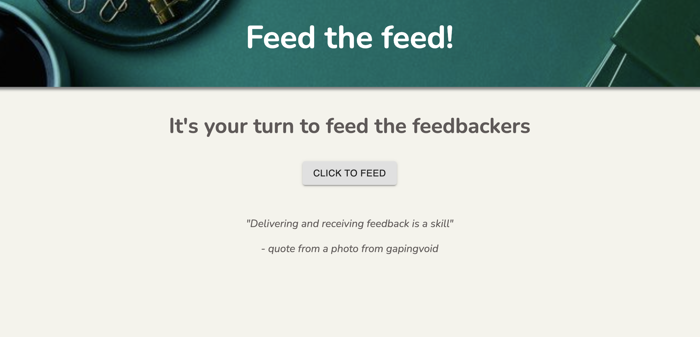
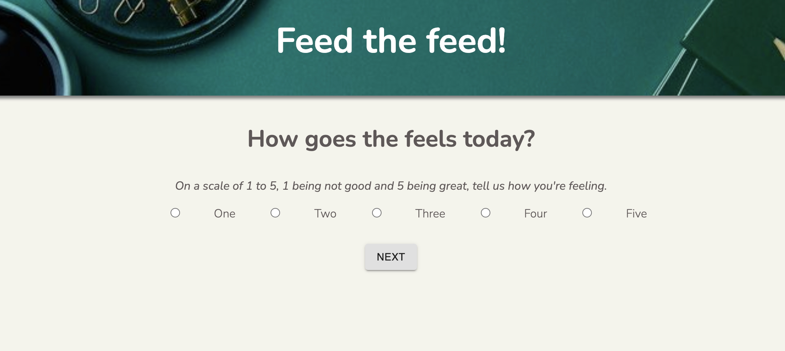
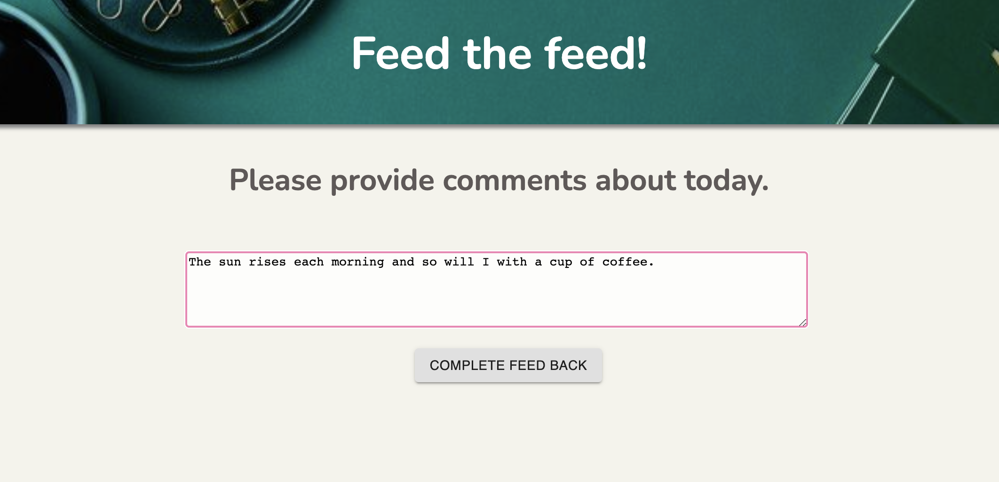
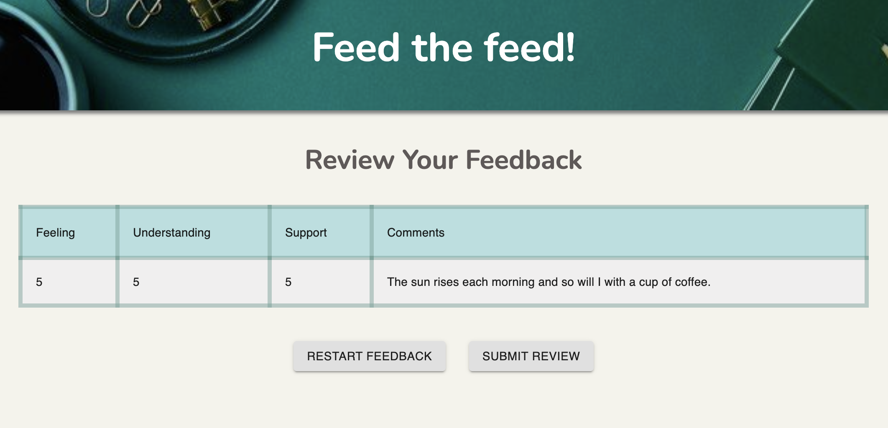

## Redux Feedback Loop

## Description

_Duration: 30 Hours of Fun and Reflection

 Application which allows user to utilize when submitting feedback to staff. Upon opening application, user will find a welcome page with a message. User will then submit ratings and comments after following flow of application from page to page. Feedback will become saved in database for staff to see once user submits feedback on a Review page.

## Sample of feedback form
Home of my application

Feelings view

Comment view

Review view

### Prerequisites

- [Node.js](https://nodejs.org/en/)
- Nodemon

## Installation

1. Create a database named `prime_feedback`,
2. The queries in the `tables.sql` file are set up to create all the necessary tables and populate the needed data to allow the application to run correctly. The project is built on [Postgres](https://www.postgresql.org/download/), so you will need to make sure to have that installed. We recommend using Postico to run those queries as that was used to create the queries, 
3. Open up your editor of choice and run an `npm install`
4. Run `npm run server` in your terminal
5. Run `npm run client` in your terminal
6. The `npm run client` command will open up a new browser tab for you!

## Usage

1. Open browser
2. Click to begin feedback
3. Choose between 1-5 rating for feelings
4. Choose between 1-5 rating for understanding
5. Choose between 1-5 rating for support
6. Type out comments
7. Review feedback, user has option to start over at this point
    or user may submit feedback 

s
## Built With

* HTML5
* CSS
* JavaScript
* React
* Redux
* Material UI

## Acknowledgement
Thanks to [Prime Digital Academy](www.primeacademy.io) who equipped and helped me to make this application a reality. (Thank your people)

## Support
If you have suggestions or issues, please email me at [maivyerthao@gmail.com]